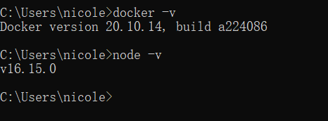
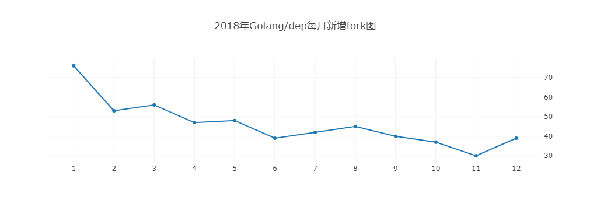
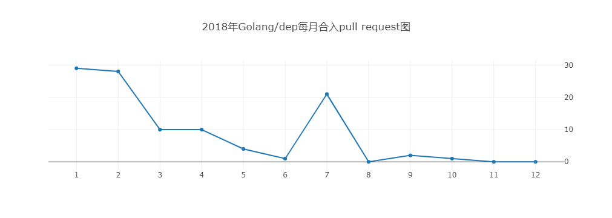
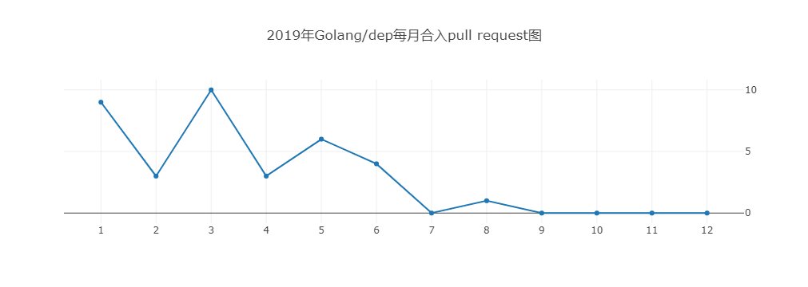

## 实践作业 7 归档开源项目分析

目标项目：golang/dep

### 一、项目的基本背景和发展历程介绍

##### 1. 技术类型

dep是一个Golang项目的项目依赖管理工具，执行一些命令后可以将Golang的依赖包自动下载并归档到vendor的目录中。

##### 2.版本发布历史

通过查阅项目仓库的Release信息：

该项目在2017年6月发布了第一个版本v0.2.0

2017年8月发布的v0.3.0：此版本中值得注意的重大变化是 dep ensure 被重构，并且bare dep ensure 不再接受参数。

2017年9月发布的v0.3.1：相对于v0.3.0有很多功能上的改变。注意其中许多更改代表更大的 WIP，例如，树散列或持久 boltdb 缓存完成，这些都会对性能产生重大影响，但这些 PR 中集成的代码目前还没有被积极使用。

2018年1月发布的v0.4.0：这个版本是 dep 的一个重要里程碑。 它删除了 dep prune 命令，将其行为完全包括到 dep ensure 中，并带有额外的细粒度控制。 这对用户的工作流程来说是一个直接的好处，也为完成 dep 设计的重要部分开辟了道路。

2018年7月发布的v0.5.0：添加了一些新的功能

2019年7月发布的v0.5.4：最后一个发布版本

##### 3. 主要贡献者的构成（国家、区域和组织等）

Dep是Golang官方推出的实验性工具，主要贡献者应该也是由官方组织的。

大多数贡献者都来自 Go organization

贡献排名top3的贡献者[sdboyer](https://github.com/sdboyer)、[carolynvs](https://github.com/carolynvs)和[darkowlzz](https://github.com/darkowlzz)都来自美国。

##### 4. CI/CD的使用

CI/CD指的是持续集成和持续发布。

Github上的CI/CD大部分借助Actions，该项目的Actions是空的https://github.com/golang/dep/actions， 因此我猜测该项目没有使用CI/CD。

##### 5. 其他有价值的信息

对于任何编程语言，依赖管理都很重要，尤其是大规模协作的软件开发。 Golang作为新兴的语言，在2015年左右还要比较长的一段路要走。

Golang 团队的设计原则是简洁，甚至强调代码的简洁胜过代码的复用。因此，他们对依赖管理的设计非常谨慎，直到v1.5才开始逐步引入依赖管理。在 v1.5 中实验性地加了 vendor 目录来支持本地依赖管理，通过环境变量来控制是否使用，v1.6 中会默认启用 vendor 特性，而v1.7 将 vendor 纳入标准特性中，并废弃 v1.5的环境变量。

Golang 虽然已经提供 vendor 特性，但只是用来存储本地依赖。如何将这些依赖高效、简洁地管理起来，官方在当时还没有给出明确的方案。但是在其官方的 Wiki 中列举了各种依赖管理工具，包括官方自己推出的实验性工具 Dep。

曾经人们一度对官方的管理工具有很高的期待，这也是dep一时流行的主要原因之一。之后，由于 Golang 作者跟 Dep 作者在 Dep 设计上的分歧，Golang 官方在 2018 年 5 月开始推Go modules，并在 Go中默认启用。 Dep就此没落，很少再有人维护了。

### 二、项目的历史轨迹分析

##### 1. 准备数据镜像和OpenDigger

###### （1）事先准备

###### （2）克隆仓库

###### （3）设置数据镜像

###### （4）设置 jupyter-notebook 环境

打开后的界面：

###### （5）配置数据源

###### （6）开始分析

##### 2. 数据分析任务

该项目于2016年创建，于2020年归档，因此对这5年的数据进行分析。

###### （1）每月新增Star和Fork的个数

2016年的fork和star数都为0，这里不列出。这里列出画图结果，表格见.ipynb文件。

新增star数的计数参考了 https://ghe.clickhouse.tech/#top-repositories-by-stars ，这里我有些疑惑的是，我认为github的Watch和Star是两种操作，而这里的type不存在StarEvent，上面的链接中计算Star使用了WatchEvent，因此我这里的数据分析结果使用的也是WatchEvent。

###### （2）每月打开Issue和关闭Issue的个数

2016年的打开和关闭issue数都为0，这里不列出。这里列出画图结果，表格见.ipynb文件。

###### （3）每月打开PR和合入PR的个数

2016年的fork和star数都为0，这里不列出。这里列出画图结果，表格见.ipynb文件。

合入的获取方式与打开PR略有不同。作业文档中提示关闭PR不是合入PR，但是我尝试了所有PullRequestEvent的action，只有opened和closed两种，我认为这里的closed应该是指关闭PR，不是我们想要的，因此还应该加上了`pull_merged=1`来筛选出已经被merge的pull request。

###### （4）每月在仓库中活跃（只要有日志产生就算）的不同开发者（也就是一个Github账号）总数

我认为与前三问的主要不同之处在于需要用到字段`DISTINCT`

###### （5）Issue从打开到关闭的平均时长和中位数（单位：天）

为了将每一年的issue放在一起计算，使用到了union all，直接合并拥有完全相同的字段的表

平均时长约为256天：

中位数是34天：

###### （6）PR从打开到合入的平均时长和中位数（单位：天）

与任务5的区别在于，已关闭的issue拥有issue开始时间和结束时间两个属性，而已merge的pr似乎只有merge时间没有创建时间，因此使用了INNER JOIN做表的连接得到最终结果。

PR从打开到合入的平均时长是10天左右：

PR从打开到合入的时长的中位数是2天：

###### （7）Issue和PR从打开到第一次有人回复（非本人回复）的平均时长和中位数

Issue从打开到第一次有人回复的平均时长是80天

Issue从打开到第一次有人回复的时长中位数是6天

PR从打开到第一次有人回复的平均时长是10天

PR从打开到第一次有人回复的时长中位数是3天

###### （8）关键或值得注意的时间节点 

官方宣称的项目的开始时间在2016年，但是2016年的数据显示Github上的golang/dep仓库几乎没有任何活动日志。我认为第一个重要的时间节点在2017年1月，这一月也几乎是该仓库2017年最活跃的时间段。

另一个重要的时间节点在2018年5月，这个时候官方开始推Go modules，也可以看到这一个月管理者关闭了较多的Issue。

这之后Dep逐渐没落，2019和2020年的活跃度大不如前，管理者在2019年的6月和2020年的9月再次集中关闭了很多的Issue。

### 三、洞察项目被归档的可能原因

- 主页、主要贡献者发表的相关技术博客：主要贡献者没有写过为何归档Dep相关的博客；在他的主页找到了fork的Dep仓库，看起来并没有PR和Issue。作者有在自己的README.md中写：Lots of functionality is knowingly missing or broken. The repository is open to solicit feedback and contributions from the community. 
- Issue 和 PR 中的相关讨论：在最近一次Issue中有官方回复“Dep was officially deprecated earlier this year, and the proposal to archive this repository was accepted. As such, I'm closing outstanding issues before archiving the repository. For any further comments, please use the proposal thread on the Go issue tracker. Thanks!” 可以看到是Golang官方自己决定弃用该仓库并且决定归档。
- README 文件，贡献者指南，Code of Conduct 及其他可能有的相关文档：阅读了README文件和贡献者指南，这其中没有包含归档相关的信息。

归档原因：官方因为有了更好的可替代的工具而决定正式归档。至于Dep作者与Golang作者是否设计理念不合，不知道真假，也许是原因之一。

归档的影响：

1.对开发者：主要贡献者有的仍在Go的团队中，有的看起来在其他地方工作，但他们的Github都比较活跃，我认为对开发者并没有什么负面影响。

2.对用户：大部分的用户都转向了Go Module，我最近正好在学习Go和使用它做一些项目，目前看起来大部分用户都适应良好。在分析这个项目之前我是只知道Go Module，并不知道Dep的存在的。在当年一些用户对项目提出了一些issue，一些没有被解决就被close了，我猜测对这波用户而言可能暂时造成了一些不便。

如何可持续发展的理解：如果要针对所有开源项目的可持续发展来谈，这一点是有很多方面的内容的。如果仅针对Golang/Dep项目来进行反思的话，
