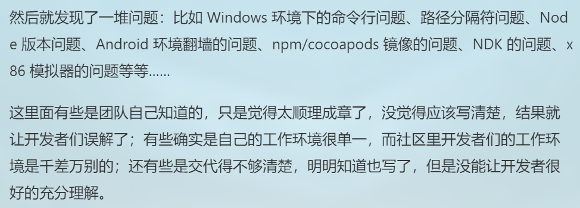
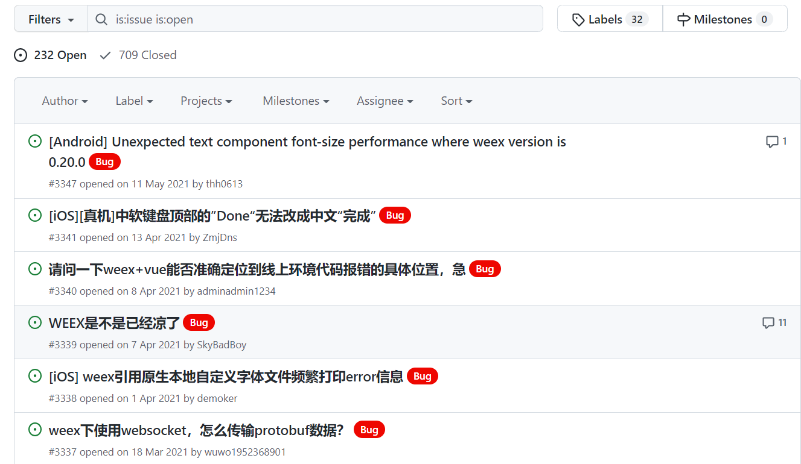

### 一、项目的基本背景和发展历程介绍

#### 1、项目简介

​   Weex 是由阿里巴巴研发的一款轻量级的跨平台 UI 框架。Weex 使开发人员能够通过单一代码库，在 iOS、Android 和 Web 多平台上部署应用，打造三端一致的 Native 应用。开发者只需要在自己的 APP 中嵌入 Weex 的 SDK，就可以通过撰写 HTML/CSS/JavaScript 来开发 Native App 级别的 Weex 界面。

#### 2、项目发展历程

​		Weex 项目总共发布了五个版本，最初版本发布于 2018 年 10 月，合并了 1417 个 commits，最终版本发布于 2019 年 10 月，合并了 191 个 commits，除了第二个 0.20 版本未合并 commit 以外，weex 项目每次发布版本所合并 commit 的数量在逐渐降低。

​		2016 年 4 月，阿里宣布开源 Weex 项目，即 GitHub 上的 [alibaba/weex](https://link.zhihu.com/?target=https%3A//github.com/alibaba/weex) 位置；2016 年 12 月 Weex 被捐赠给了 Apache 软件基金会并开始孵化，一开始使用他们自己的 git 服务托管代码，后来迁移到了[apache/incubator-weex](https://link.zhihu.com/?target=https%3A//github.com/apache/incubator-weex) 位置；2017 年初，项目发起人勾股发表了一份声明：不再是 Weex 团队的一员，离开淘宝，新的工作内容已与 Weex 无关；2021 年 4 月，因 Weex 项目 PPMC 不够活跃，Apache IPMC 发起了关于 Weex 的“退休“投票，并且获取了一致通过，最终 Apache Weex 项目回归到 [alibaba/weex](https://link.zhihu.com/?target=https%3A//github.com/alibaba/weex) 继续维护，内部工作流迁移到 GitHub。

#### 3、项目导师和贡献者

​		Weex 项目拥有两个导师，Myrle Krantz 和 Willem Ning Jiang，其中 Willem Ning Jiang，也就是姜宁，从 2006 年开始一直从事 Apache 开源中间件项目的开发工作，先后参与 Apache CXF，Apache Camel，以及 Apache ServiceMix 的开发。

​		姜宁最初参与开源项目是因为 IONA 科技公司有个项目要开源，他就轻松成为了一个初始 committer，开始接触 Apache 软件基金。08 年时在 Apache Camel 项目中，姜宁被选举成为 committer，开源之路开始走顺了。后来又参与了很多 Apache 项目，开始 mentor 别人，直到有一天收到 ASF 的信，邀请姜宁成为 Apache member。

​		Weex 项目的大部分 contributors 都是来自于阿里团队，包括@DoranYun @Hanks10100 @IskenHuang @Jinjiang @MrRaindrop @songsiqi @terrykingcha @vczero @yuanyan @Tancy @Fkysly，但是贡献排名前二的@acton393 和 @sospartan 没有在互联网上找到相关资料，但猜测大概率也是阿里团队的成员。

#### 4、项目 CI/CD 的使用

​		项目 Project 中的目标有提及希望参与者能帮助构建用户友好的高可用性持续集成(CI)环境，并在每次创建或更新 GitHub PR 时触发 CI 构建，项目根目录下存在**.travis.yml**文件通过 travis ci 来更新 xcode 版本。

#### 5、项目被多数人关注的原因

​		在 Weex 项目宣布开源内测的当天就有大量的开发者涌入，两周内就有5000多开发者申请。到正式开源时，当天 Weex 就登上了 GitHub Trending 榜榜首；并且开源的第一周内，其都在 Trending 榜上。

​		2015 年的时候，整个互联网都在做 PC 到移动端的转型。移动端流量暴涨，但设备的性能还很差，Webview 能力很弱兼容性也不好，使得 Hybrid、WeApp、WVC、ReactNative 各自建设，方案不通。而在此契机之下，Weex 能让一份代码在三个端(iOS、Android 和 Web)的运行体验一致，并且做到浏览器内核级的稳定性和研发机制，实现高性能和持续稳定性的运行保障机制，从而使得 Weex 还没那么成熟的时候就快速的铺开。

#### 6、项目的应用场景

​		通过查阅相关资料，目前钉钉、手机淘宝、闲鱼、优酷、淘宝直播、微博、菜鸟裹裹、饿了么、滴滴出行等 app 都使用了 Week 移动跨平台技术。

​		累计下来，集团内外共有上百个 App 接入了 Weex，图里只是一部分。2020年，有人通过反编译分析大厂都用了哪些跨平台框架，在 52 个 App 里，19 个用了 Flutter，17 个用了 Weex，22 个用了 ReactNative，Weex 的使用量也还算不少。

### 二、项目的历史轨迹分析

​		完成了任务 1-4，详细数据展示可见 10184800428-data.ipynb 文件

### 三、洞察项目被归档的可能原因

​		在**项目的发展历程**中有提及过，在 2021 年 4 月，Apache IPMC 发起了关于 Weex 的“退休“投票，并且获取了一致通过，最终导致 Weex 项目未能从 Apache Incubator 毕业，这也是 [apache/incubator-weex](https://link.zhihu.com/?target=https%3A//github.com/apache/incubator-weex) 项目被归档的直接原因，接下来我将分析 Weex 项目未能成功毕业的原因。

#### 1、项目的相关信息

- 勾三股四的博客

  ​		勾三股四，Weex 项目的发起人，在 Weex 开源四个月左右时，在博客中提及团队遇到了一些先前未曾想到的问题，包括运行程序的说明因为觉得太顺理成章、工作环境单一、交代的不清楚等问题，导致开发者没能充分理解，提出许多先前未曾预料到的问题；项目的 issue 比想象中火爆，导致正常的研发迭代被应付这些 issue 变得支离破碎。虽然博客中所提及的问题经过项目初期的摸爬滚打基本已被解决，但一定程度上也可能是后续 Weex 项目未能成功毕业的导火索。

  

- 知乎的提问

  ​		知乎上有人提出过**如何看待 Weex 项目未能从 Apache Incubator 毕业**的问题，Apache Weex 的 PPMC 成员之一有回应到主要是由于 PPMC 的投入不足，项目捐赠时对 Apache 运行机制和毕业流程的理解不足。

  ​		而 PPMC 的投入不足原因也有一些猜测，有人猜测是项目作者勾三股四离职退出 Weex 项目，也有人猜测起初创建 Weex 开源项目是为了有效提升晋升评审时的打分，而维护开源项目对程序员的 KPI 没有好处，所以使得后续 PPMC 的投入不足。

  ​		Weex 项目团队成员之一 undefined 也发表了一篇知乎专栏**五年陈的 Weex，聊聊它的过去现在和未来**，其中提及 Weex 曾被吐槽文档不清晰、Roadmap 不明确、开发体验差、难调试等等，个人认为一定程度上这些原因也可能造成后续 Weex 项目未能成功毕业。

- Issue 的相关讨论

  ​		Weex 项目在 2020 年基本就没什么活动，邮件列表也凉了，基本社区交互就已经失败。

  

  ​		在 issue 方面，其存在 709 个已经关闭的 issue，232 个仍然开放的 issue，具有很高的未解决数量，并且具有不统一的社区交流语言。而且 issue 中存在很多关于运行项目时报错无法解决的问题，可见 Weex 项目本身还是具有很多为解决的问题的。

  ​		

#### 2、项目归档的原因/未能成功毕业的原因

​		我认为 Weex 项目最终未能从 Apache Incubator 毕业的主要原因在于后期 PPMC 的投入不足，项目基本没有活动，对 issue 问题也没有及时积极的处理，导致有大量的 issue 未被解决。而开发文档不清晰、Roadmap 不明确、开发体验差、难调试等等问题虽然不是直接导致 Weex 项目未能成功毕业的主要原因，但一定程度上表明阿里团队的成员对开源项目的维护并没有充足的经验，使得前期准确不够充足，导致项目开源后产生超出预期的问题。

​		针对为什么 Weex 项目后期 PPMC 投入不足的猜测，个人比较偏向于阿里团队的成员没有空余的时间和精力来继续维护 Weex 项目，从而很遗憾的导致了这个项目未能成功毕业。对于项目作者勾三股四的离职和 Weex 项目开源是为了冲 KPI 等的猜测，我个人其实不是很相信这是造成后期 PPMC 投入不足的原因，但也不排除其不是造成投入不足的原因。

#### 3、项目归档后产生的影响

​		虽然 [apache/incubator-weex](https://link.zhihu.com/?target=https%3A//github.com/apache/incubator-weex) 项目归档了，但 Weex 项目回归到 [alibaba/weex](https://link.zhihu.com/?target=https%3A//github.com/alibaba/weex) 继续维护，开发者仍然可以对 Weex 项目提出 issue 和 pull requests。但 Weex 项目后期的 PPMC 投入不足也使得一部分开发者对此产生不信任，自己提出的 issue 或者 pull requests 未得到回应，从而决定不再使用或者关注 Weex 项目。

#### 4、开源项目如何可持续发展

​		Weex 这个项目让我认识到维持开源项目持续发展是费时费力的，并不是说将代码丢到 GitHub 上就算行了，这种开源不是没有价值，但价值是约等于 0 的。维持开源项目可持续发展，需将开发者提交的每一个 pull request、每一条 issue、甚至每一句评论和吐槽都进行查看或者回应，这样才能发现项目自身的不足之处和改进创新的方向，和广大的开发者相互交流，思想碰撞，才能做出优秀的开源项目，做出真正做出好的项目。

​		与此同时，对待开源项目不能三分钟热度，像 Weex 项目在后期并没有进行持续维护，PPMC 投入不足，最终导致未能成功从 Apache Incubator 毕业，所以对待开源项目需善始善终，无论是前期还是后期遇到的问题，都需花费时间花费精力去积极解决，不能虎头蛇尾的进行对待，方能使得开源项目持续发展。
