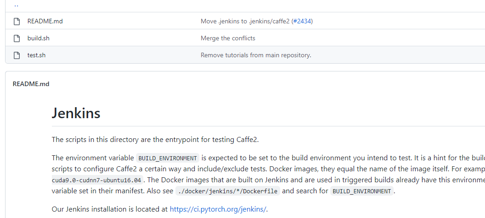
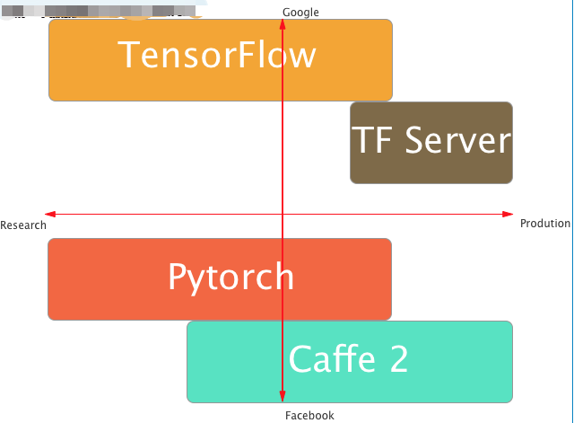

# 归档开源项目分析：facebookarchive/caffe2

**10185501403**

**张硕闻**

## 1 项目的基本背景和发展历程介绍

- 技术类型
- 版本发布历史
- 主要贡献者的构成（国家、区域和组织等）
- CI/CD 的使用
- 其他有价值的信息

### 1.1 项目简介与技术类型

Caffe2是一个轻量级、模块化和可扩展的深度学习框架。在原始Caffe的基础上，Caffe2的设计考虑到了表达、速度和模块化。

Caffe2的特性：

- Caffe2框架可以通过一台机器上的多个GPU或具有一个及多个GPU的多台机器来进行分布式训练。
- 也可以在iOS系统、Android系统和树莓派（Raspberry Pi）上训练和部署模型。
- 只需要运行几行代码即可调用Caffe2中预先训练好的Model Zoo模型。
- Caffe2框架已经应用在Facebook平台上。
- NVIDIA（英伟达），Qualcomm（高通），Intel（英特尔），Amazon（亚马逊）和Microsoft（微软）等公司的云平台都已支持Caffe2。
- GitHub上有Caffe2的源代码。

Caffe 2重视**移动计算**——Caffe2针对ARM CPU进行了优化，拥有超越机载GPU的优势。它支持Andriod和iOS。轻量级和可扩展支持分布式计算可用于生产环境Python和C ++ API“代码编写一次，可到处运行”。作为一个kickstart，Caffe2还提供了内置的标准深度学习架构模型，以便任何人都可以在此基础上进行开发，而不必从头开始。Facebook发布的广泛流行的PyTorch框架，PyTorch是专为研究建立神经网络和实验而开发的。Caffe2是专为**移动生产环境**而设计的，可以在各种移动平台上部署大规模数据。

### 1.2 版本发布历史

根据 Github 上的记录，共发布了四个版本：

1. Caffe2 v0.6.0 2017年4月4日
2. Caffe2 v0.7.0 2017年4月19日
3. Caffe2 v0.8.0 2017年7月22日
4. Caffe2 v0.8.1 2017年8月9日

### 1.3 主要贡献者

Caffe2由Facebook的团队开发，最主要贡献者是贾扬清。

贾扬清，Facebook研究科学家，曾在Google Brain工作。在AI领域有数年的研究经历。在UC Berkeley获得计算机科学博士学位，在清华大学获得硕士和本科学位。对两款流行的深度学习框架做过贡献：Caffe的作者，TensorFlow的作者之一。

### 1.4 CI/CD 的使用

根据Github中的记录

项目的的持续集成持续交付使用Jenkins来构建。

Jenkins是一个开源的、提供友好操作界面的持续集成(CI)工具，主要用于持续、自动的构建的一些定时执行的任务。Jenkins用Java语言编写，可在Tomcat等流行的容器中运行，也可独立运行。

### 1.5 其它

**与其它深度学习框架的对比**

简言之，Caffe2是Facebook为移动计算发布的模块化深度学习框架。

下图有一个简要的对比

与 Caffe相比，Caffe2在工程上做了很多优化，比如运行速度、跨平台、可扩展性等，它可以看作是Caffe更细粒度的重构，但在设计上，其实Caffe2与TensorFlow更像。

与Pytorch相比，Caffe2长于移动和大规模部署。虽然Caffe2新增了支持多GPU的功能，这让新框架与Torch具有了相同的GPU支持能力，但是Caffe2支持一台机器上的多个GPU或具有一个及多个GPU的多台机器来进行分布式训练。PyTorch适合进行研究、实验和尝试不同的神经网络；而Caffe2更偏向于工业应用，而且重点关注在移动端上的表现。

## 2 项目的历史轨迹分析

**见ipynb文件**

## 3 洞察项目被归档的可能原因

- 阅读分析项目的相关信息：
  - 主页、主要贡献者发表的相关技术博客
  - Issue 和 PR 中的相关讨论
  - README 文件，贡献者指南，Code of Conduct 及其他可能有的相关文档
- 结合一和二中得到的信息和分析结果，尝试总结项目可能的归档原因
- 结合你搜集到的信息，尝试分析项目归档后可能产生的影响（对开发者和用户）
- 表述你对开源项目如何可持续发展的理解

参考：

https://caffe2.ai/blog/2018/05/02/Caffe2_PyTorch_1_0.html

https://pytorch.org/blog/the-road-to-1_0/

https://www.zhihu.com/question/270578639

https://github.com/facebookarchive/caffe2/issues/2439

> As a step to bring our engineering efforts together, we are merging the Caffe2 repository into the PyTorch repository - we picked the PyTorch repo as the one to combine into, because this will incur minimal overhead for the python user community. These changes will tentatively be made this Friday (March 30, 2018) and [@orionr](https://github.com/orionr) is taking lead on the engineering fronts of repo merging.

### 3.1 被归档的原因

项目被归档的原因不难得出，2018年4月1日，Caffe2的GitHub页面宣布了Caffe2正在并入PyTorch，至此，Facebook主力支持的两大深度学习框架已经合二为一。2018年5月，PyTorch 1.0版本发布，Caffe2基本完成并入，同年11月，Caffe2项目被归档。

根本原因是Caffe2并入PyTorch，一些直接原因包括：代码已经全部并入PyTorch项目，对Caffe2代码的维护等等要考虑到与PyTorch项目的关联性，因此应该在PyTorch项目上进行代码的维护，而Caffe2项目设置为归档。

根据主要贡献者贾扬清的说明：“PyTorch有优秀的前端，Caffe2有优秀的后端，整合起来以后可以进一步最大化开发者效率。”将Caffe2项目归档，其实引导着Caffe2社区开发者进入PyTorch社区，这样PyTorch的社区可以变得更加活跃，有利于PyTorch框架的开源工作。

### 3.2 归档带来的影响

至于项目归档后带来的影响，对于开发者而言，Caffe2社区与PyTorch社区合二为一，必将发展得更为壮大，原本的Caffe2开发者需要考虑与PyTorch的适配，同样地，原本的PyTorch开发者也需要考虑与Caffe2的适配，考虑到是Caffe2并入PyTorch，那么PyTorch开发者受到的影响会更小。

对于用户而言，根据Caffe2的主页，Caffe2的API依然可用，但是用户被建议使用PyTorch的API。对于PyTorch用户，几乎不受影响。而对于Caffe2用户，他们考虑到所使用框架的稳定性（Caffe2接口已经不再更新，而PyTorch会持续更新），他们短期内或许会继续使用Caffe2接口，但长期来看更可能学习PyTorch，使用PyTorch，因此可能要付出一些学习成本。当然PyTorch融合Caffe2后变得更加强大，方便了用户的使用。tf不再是一家独大，用户们有了优秀的PyTorch作为新的选择。这些是积极的影响。

### 3.2 对开源项目可持续发展的理解

开源项目若想可持续发展，我认为首先开源项目的主要贡献者要有比较明确的目标。项目目前处在什么位置，项目未来要到达什么位置，这些问题主要贡献者们应该有考量。其次，项目必须有显著的优点才能在发展初期吸引足够多的贡献者，可以是解决了某个痛点，十分有用，或者设计十分精巧等等。再次，应该有足够清晰的工作流，比如如何对项目提出PR呢，项目需要什么样的PR呢，这些问题应该在文档中写明。再次，应该建立健康的社区，开发者在社区中友好交流，共同进步。最后，开源并不等于放弃商业模式，如果开源项目一直没有任何回报确实是难以长久的，因此应该探索合适的商业模式。一些非常成熟的开源基金会也可以组织和引导大家形成开源的规范，比如Apache等等。

